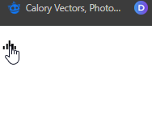

# Icona animata al click con riproduzione howler js

## Description

A simple icon resembling sound waves that animates when pressed and plays a set audio.
(ita)
Una semplice icona che ricorda le onde sonore che si anima quando viene premuta e riproduce un audio impostato.

## Technologies used
This simple icon is developed using the following technologies:

- HTML
- CSS
- JavaScript
- <a href="https://howlerjs.com/">Howler.js</a> (Audio library for the modern web.)

## How to install

To install the web app, follow the following steps:

1. Clone the repository from GitHub to your computer.
6. Open the index.html file in your browser.

## How to contribute

If you want to contribute to this project, you can perform the following actions:

1. Fork the repository
2. Create a new branch with your user name
3. Make the necessary changes
4. Push the changes to your fork
5. Create a pull request

## Crediti
This project-exercise was created by Gianpiero Ferraro.(https://www.linkedin.com/in/gianpiero-ferraro/)
